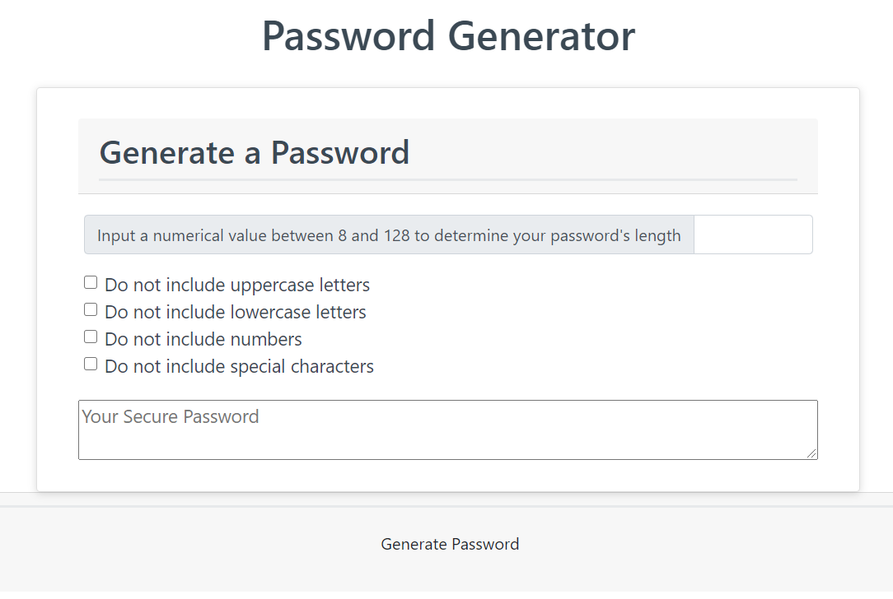

# Title

Javascript password generator

This is a single page application which is designed to create passwords to a user's specifications. The user can choose how many characters are in the password, along with what characters will be used to make it.

# Installation

A live deployment can be found here<a href="https://nboutin109.github.io/Javascript-password-generator/"> 
https://nboutin109.github.io/Javascript-password-generator/</a>

To use locally, simply download the files and open the index.html file with an internet browser

## Built With
<ul>
<li>jQuery - CDN link included</li>
<li>Bootstrap - CDN link included</li>
</ul>

## Code Overview
Code from index.html is rendered and styled with the style.css file and Bootstrap. The script.js file contains all possible characters in arrays. Those arrays are then added to an overall array unless the user checks a box to not include some characters. Characters equal to the inputted length are then randomly generated and returned as a string for display.

